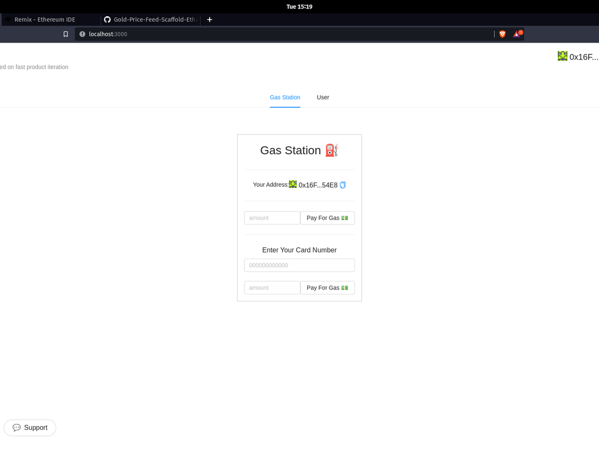

# Subsidy Provider using Scaffold Eth 💵

## Intoduction 💁
Hardhat 👷 project and source code availabe - [SubsidyProvider](https://github.com/priyanshu87694/Subsidy-Provider)

## Getting Started 🟢
Must add a `.env` file in hardhat folder in `/packages/hardhat/` that contains
1. `GOERLI_RPC_URL` as the rpc url for goerli network
2. `PRIVATE_KEY` as private key of the wallet or deployer

### Start ✴️ React app
    ```
    yarn start
    ```

### Deploy 📡 the GasStation Contract

    default network is `goerli`
    ```
    yarn deploy --network goerli
    ```

### Gas Station View


### User / Card view

